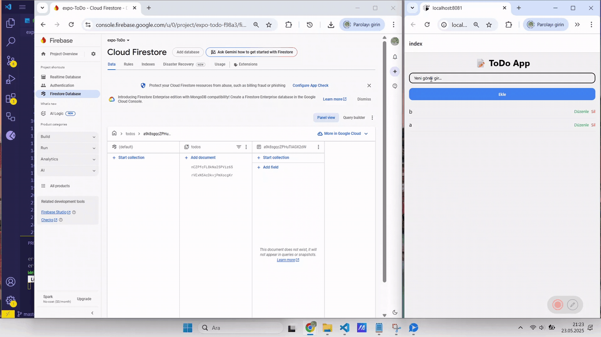

# Expo ToDo App 📝

Bu proje, React Native ve Firebase kullanılarak oluşturulmuş basit bir yapılacaklar (ToDo) uygulamasıdır. Kullanıcıların görevlerini ekleyip, görüntüleyip, düzenleyip ve silebildiği temel bir CRUD yapısını içerir.

## 🔧 Kullanılan Teknolojiler

- React Native (Expo)
- Firebase Firestore
- NativeWind (Tailwind CSS benzeri stil kütüphanesi)
- Expo Router

## ✨ Özellikler

- Yeni görev ekleme
- Mevcut görevleri listeleme
- Görev silme
- Görev güncelleme

## 🖼️ Uygulama Görseli



## 🚀 Kurulum ve Çalıştırma

### 1. Projeyi klonlayın:

```bash
git clone https://github.com/kullanici-adi/proje-adi.git
cd proje-adi
```
